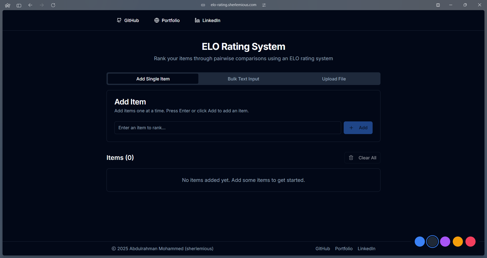
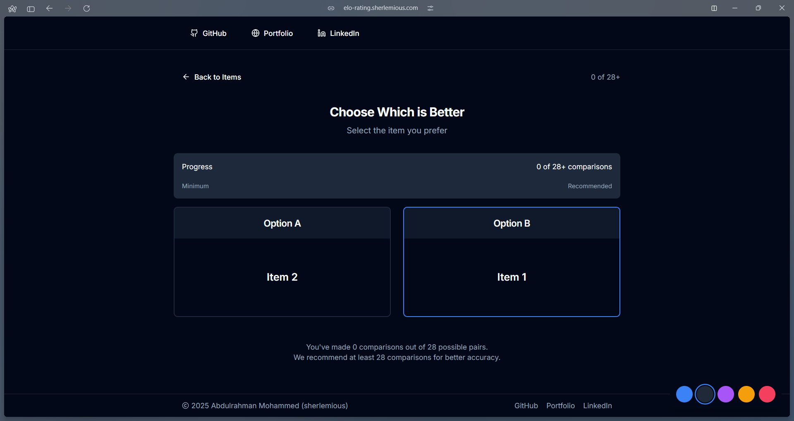
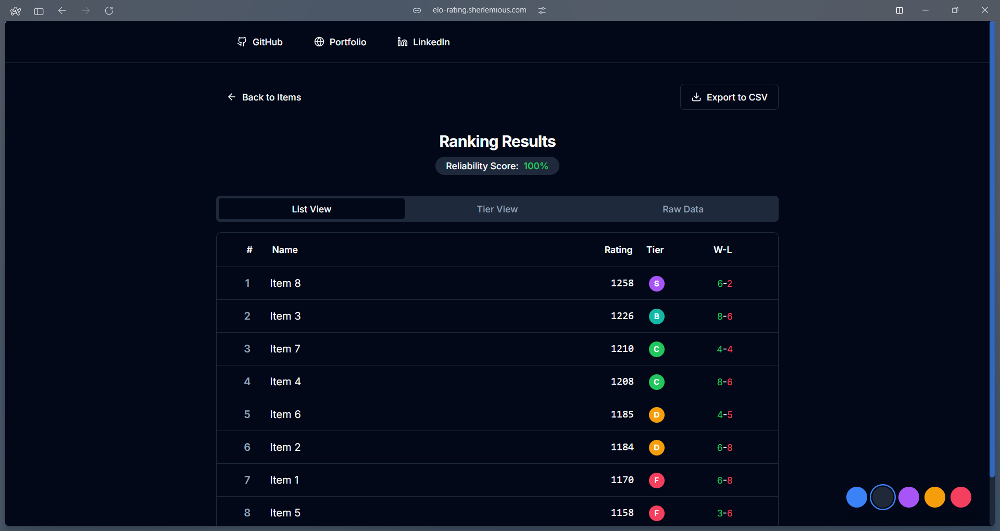

# Elo Item Ranker

A modern web application that uses the Elo rating system to rank and compare your items through pairwise comparisons.



## Features

- **Simple Item Management**: Add items one by one, in bulk, or through CSV file import
- **Pairwise Comparisons**: Make simple A/B choices to rank your items
- **Elo Rating Algorithm**: Sophisticated rating system that adapts to your preferences
- **Tier Rankings**: Items are automatically grouped into S, A, B, C, D, F tiers
- **Beautiful UI**: Clean, modern interface with light and dark mode support
- **Responsive Design**: Works perfectly on both desktop and mobile devices
- **Data Export**: Export your rankings as CSV for further analysis



## Use Cases

### 1. Movie Rankings

Create your personal movie ranking by comparing films head-to-head. Simply add your movie list and start comparing. The Elo algorithm will help you discover which movies you truly prefer over others.

### 2. Product Decision Making

When deciding between multiple product options, use Elo Item Ranker to clarify your preferences through systematic comparisons rather than trying to rank everything at once.

### 3. Team Prioritization Sessions

For team decision making, use the app to prioritize features, tasks, or projects by having team members vote through simple pairwise comparisons.

### 4. Personal Lists

From ranking your favorite books to prioritizing life goals, the application helps bring structure to subjective preferences.



## How It Works

1. **Add Items**: Enter the items you want to rank through various input methods
2. **Make Comparisons**: Select which item you prefer in each presented pair
3. **View Results**: After enough comparisons, see detailed rankings with tiers and statistics
4. **Export Data**: Download your results as a CSV file for further analysis

## Technical Details

- Built with React and TypeScript
- UI components from Shadcn UI
- Tailwind CSS for styling
- Elo rating system for accurate preference calculation
- Reliability score to measure ranking confidence

## Getting Started

```bash
# Clone the repository
git clone https://github.com/your-username/elo-item-ranker.git

# Navigate to the project directory
cd elo-item-ranker

# Install dependencies
npm install

# Start the development server
npm run dev
```

## License

MIT

## Author

Abdulrahman Mohammed (sherlemious)

- [GitHub](https://github.com/sherlemious)
- [Portfolio](https://www.sherlemious.com)
- [LinkedIn](https://www.linkedin.com/in/sherlemious)
